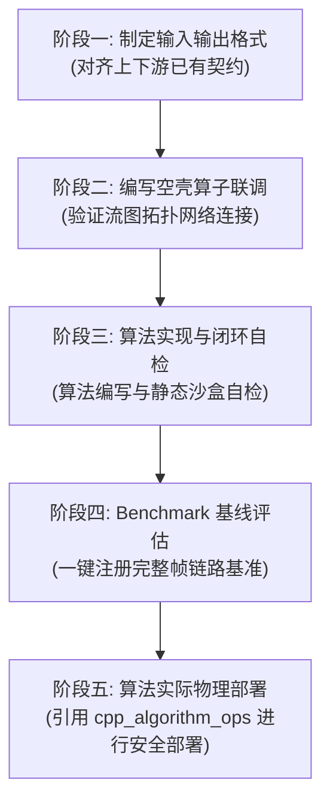

# Cycore Flowgraph 算子开发指南

> [!IMPORTANT]
> **模板 SDK 快照**：
> 算法开发使用模板内 `sdk/include` 的稳定快照，以保证模板可独立编译。开发者不得
> 修改、替换或为单个算法扩展该快照；SDK 维护者更新主 SDK 后才可重新生成模板快照。
> 上下游插件必须使用兼容的编译器 ABI、对象布局和字节序。

## 💡 核心开发工作流 (必须严格按阶段顺序执行)

### 📂 阶段一：制定数据格式 (I/O Specification)

1. **强类型完整帧**：算法自行定义默认可构造的 `InputData`、`OutputData`。
   默认采用 `header + std::vector payload` 变长帧；固定 POD 继续兼容。
2. **连续元素约束**：变长帧的 `header` 必须平凡可复制，`payload` 元素必须
   平凡默认构造且平凡可复制，
   `payload` 必须是默认 allocator 的 `std::vector<Element>`；禁止字符串、指针、
   Span/View、虚函数和其他外部内存所有权。
3. **0 手写 Codec**：SDK 按成员名自动选择固定 POD 或 vector 帧 Codec。算法不得
   解析 Envelope、手工透传元数据或操作字节流。
4. **显式最大帧长**：变长输入输出必须配置 `max_input_frame_bytes` 和
   `max_output_frame_bytes`，SDK 在 Adapter 构造阶段一次性预留容量。
   *详细规范请参阅子指南：[2. 输入输出数据格式制定规范](references/data-format-specification.md)*

### 📂 阶段二：空壳算子全系统联调 (Skeleton Integration)

1. **直通联调逻辑**：
   * **输入输出格式相同**：将 `work` 函数写成强类型直通（Pass-through）逻辑，将输入数据无损复制到输出。
   * **输入输出格式不同**：根据输出的格式契约，将输入数据在 work 中进行最基础的格式转换映射（如只取实部转换或填充特征常量值），形式化地满足输出类型。
2. **联调与波形观察**：
   * 将空壳插件通过专属的 [C++ 算法统一部署运维手册 (cpp_algorithm_ops)](../cpp_algorithm_ops/SKILL.md) 编译并部署到目标物理机，启动流图。**在前端 cyweb 订阅对应的 Probe 探针，直接观察波形，验证系统链路是否 100% 连通（包括拓扑连接、网络通道打流以及前端解析渲染）**。

### 📂 阶段三: 算法实现与闭环自检 (Implementation & Verification)

1. **算法编写**：在骨架验证通过后，直接处理 SDK 已完整解码的 `InputData`，并写入已预留容量的 `OutputData`。字节拆帧、折返拼接、输入消费和输出封包均由 SDK 负责。
2. **沙盒自检**：只在 `test/qa_algorithm_block.cpp` 中直接实例化静态测试 Block（`SimSource` / `SimSink`），对输出结果进行 Epsilon 理论精度与通道隔离度断言。不要在算法模板新增插件加载、编译失败、分配探测或 CMake 辅助测试。
   *详细模板与自检规范请参阅子指南：[3. 算法实现与自检规范](references/algorithm-implementation.md)*

### 📂 阶段四：Benchmark 基线评估

全部 QA 通过后，使用 `<cycore_benchmark_harness.h>` 和
`CYCORE_REGISTER_BENCHMARK` 注册完整帧链路基准。算法开发者只负责构造强类型
`InputData`；Port、连接、SDK Envelope、调度、输出消费、计时和指标计算全部由
Harness 完成。

Harness 自动输出 frames/s、Payload GiB/s、平均延迟、稳态分配次数及 checksum。
具体写法见 [算法实现与自检规范](references/algorithm-implementation.md)。
算法模板的 `test/` 目录只保留 `qa_algorithm_block.cpp` 和
`bm_algorithm_block.cpp`；框架级防御测试由 SDK/Core 自身维护。

### 📂 阶段五：算法实际物理部署 (Actual Deployment)

算法插件的分布式多节点同步、Docker隔离编译、前置测试熔断自检以及容器热重启，已由专属的运维技能包统一接管：

* **请点击直达阅读**：**[C++ 算法统一部署运维手册 (cpp_algorithm_ops)](../cpp_algorithm_ops/SKILL.md)**。

---

## 📚 详细子指南引用 (开发到对应阶段时查看)

请根据需要利用 `view_file` 阅读以下详细开发参考文献：

* [1. 模板目录结构与修改范围](references/template-structure.md)
  * **前期准备**：熟悉开发脚手架和修改范围。
* [2. 输入输出数据格式制定规范](references/data-format-specification.md)
  * 执行阶段一（制定格式）时阅读，学习变长 vector 帧、固定 POD 兼容和原生 ABI 规约。
* [3. 算法实现与自检规范](references/algorithm-implementation.md)
  * 执行阶段三（编写与自检）时阅读，学习强类型帧处理、完整性边界和静态自检沙盒。
* [C++ 雷达算法统一部署运维手册 (cpp_algorithm_ops)](../cpp_algorithm_ops/SKILL.md)
  * 执行阶段五（编译部署）时阅读，获取最新的分布式环境变量定义、AArch64交叉编译、单测前置熔断以及容器热重启命令。
