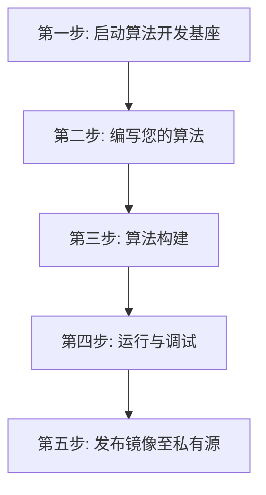

# UESTC Radar - 核心算法开发模板 (Algorithm)

欢迎！本目录是雷达**算法工程师**专用的开发模板。

通过底层的零拷贝技术和分布式网关，我们已经将复杂的网络通信、内存管理、背压阻塞全部封装成了“黑盒”。对于算法开发者而言，世界上只有一个东西：**“一口源源不断涌出测试数据的雷达数据井”**。

## 开发全流程概览



## 第一步：一键启动“算法开发基座”

在开始写您的数学公式之前，您需要先用 `docker-compose` 把底层基础设施（包括模拟数据发生器、网络路由节点等）在后台启动。**这些细节对您完全屏蔽，您只需执行即可。**

请直接使用本目录为您准备好的 `docker-compose.infra.yaml` 启动基座：

```bash
docker compose -f docker-compose.infra.yaml up -d
```

启动成功后，水管已经接通，模拟数据已经堵在 `sidecar-beta` 的内存中，等待您的算法提取。

## 第二步：编写您的算法

在框架下，您完全不需要关心底层网络。所有的复杂度（包括通信、内存管理）都被封装在 `sdk.h` 中，而业务数学逻辑（如脉冲压缩）则封装在 `my_algorithm.hpp` 中。

您的主程序（`main.cpp`）将变得像自然语言一样清晰易懂。以下是使用 SDK 的标准“四步曲”伪代码：

```cpp
#include <data.h>            // 1. 引入雷达标准数据结构定义 (如 IQFrame, PulseCompressionFrame)
#include <sdk.h>             // 2. 引入雷达零拷贝 SDK 核心通信管道接口
#include "my_algorithm.hpp"  // 3. 引入算法工程师自定义的数学解算头文件

int main() {
    using namespace uestcradar;

    // 第一步：声明输入/输出管道（自动连接 Sidecar 共享内存数据井）
    Input<IQFrame> input;
    Output<PulseCompressionFrame> output;

    // 第二步：从共享内存中阻塞读取一帧雷达原始 IQ 信号数据
    auto iq = input.read();

    // 第三步：在共享内存中创建并初始化输出帧的初始值
    auto pulse = output.create({
        .frame_id = iq.metadata.frame_id,
        .channel_count = iq.metadata.channel_count,
        .range_bin_count = iq.metadata.samples_per_channel,
    });

    // 第四步：调用算法核心逻辑，将输入的 IQ 时域数据解算为脉频数据
    process(iq.data, pulse.data);

    // 第五步：将处理完成的数据帧提交写出至下游
    output.write(pulse);
}
```

请直接打开本目录 `src/` 下的 `main.cpp` 查看完整源码，它将作为您的开发模板。

## 第三步：算法构建

写好算法后，使用本目录极简的 `Dockerfile` 编译出您的算法容器。
（得益于底层的 `algo-base`，您只需要在这个目录下直接执行构建即可，使用 `--pull` 可确保拉取最新的基座镜像，避免 SDK ABI 不一致问题！）

```bash
docker build --pull -t my-radar-algorithm:dev .
```

## 第四步：运行与调试

您可以带上 `--ipc container:sidecar-beta` 这把钥匙，将您的算法像插件一样挂载到基座上运行。我们提供了两种运行模式：

**模式 A：直接运行算法**
如果您确认代码无误，希望让它在后台默默跑完并输出结果文件，请明确指定 `--entrypoint` 为算法主程序：

```bash
docker run -d --rm \
  --name my-algorithm \
  --network host \
  --ipc container:sidecar-beta \  # 共享 sidecar-beta 的内存通道
  -v $(pwd)/output:/output \      # 挂载输出路径保存频谱图像
  --entrypoint /app/algorithm \
  my-radar-algorithm:dev
```

运行结束后，在本地的 `output` 文件夹查看 `pulse_compression_result.pgm` 的脉冲压缩结果图像，完成算法闭环验证。

**模式 B：进入容器交互式调试**
如果您的算法抛出了异常，或者希望像在本地一样使用 `gdb` 或修改代码，请将 `--entrypoint` 覆盖为 `/bin/bash` 并开启交互终端（`-it`）：

```bash
docker run -it --rm \
  --name my-algorithm-debug \
  --network host \
  --ipc container:sidecar-beta \  # 共享 sidecar-beta 的内存通道
  -v $(pwd)/output:/output \      # 挂载输出路径
  --entrypoint /bin/bash \
  my-radar-algorithm:dev
```

进入容器后，由于底层自带了完整的 C++ 编译工具链，您可以手动执行 `./algorithm` 观察报错输出。甚至可以将本机代码目录挂载进去当场修改、当场重新编译，无需反复构建镜像，极大地提升调试效率！

## 第五步：发布镜像至私有源 (用于生产部署)

当您的算法经过本地验证后，您可以将其推送到私有仓库，从而将算法部署到真实的物理雷达基站或云端集群中。

```bash
# 1. 打上符合私有源规则的 Tag
docker tag my-radar-algorithm:dev registry.chengyistudio.com/cxx/my-radar-algorithm:v1.0.0

# 2. 登录私有仓库 (若未登录)
docker login registry.chengyistudio.com

# 3. 推送到远端
docker push registry.chengyistudio.com/cxx/my-radar-algorithm:v1.0.0
```

至此，您的核心算法就已经成功发布，可以脱离开发环境独立运行了！
