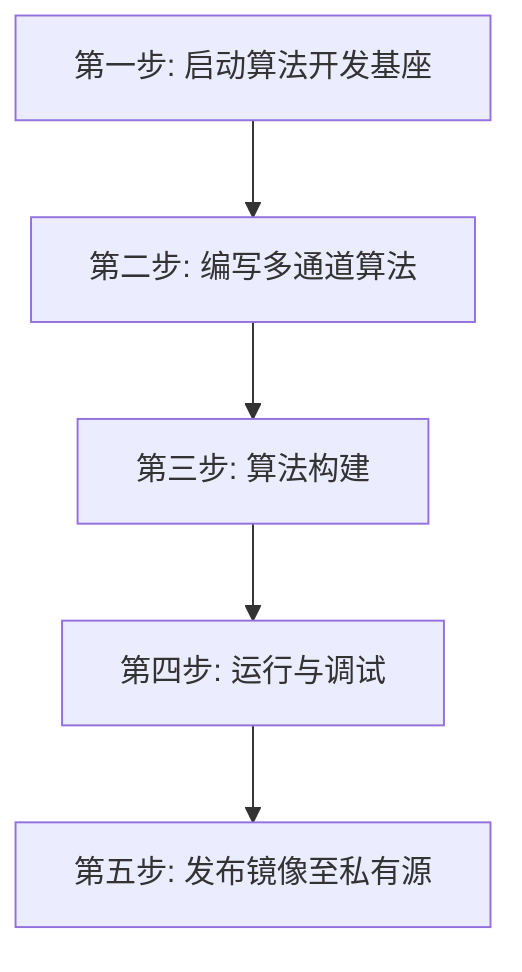

# UESTC Radar - Qt5 多线程并行算法开发模板 (Qt5 Algorithm)

欢迎！本目录专为熟悉 Qt 框架的**算法工程师**打造。

通过引入 Qt5 极其优雅的 `QThread` 与信号槽（Signals & Slots）机制，我们解决了一个核心痛点：**如何避免复杂的数学解算（如 FFT）拖慢网络数据拉取，导致底层缓冲区溢出？**

本模板向您展示了经典的“**单线程后台抽水、多线程解包分发**”架构。对算法开发者而言，基座网络和线程池派发逻辑已被完美封装，您只需专注于编写并行的通道解算算子。

## 开发全流程概览



## 第一步：一键启动“算法开发基座”

在开始写您的算法之前，您需要先用 `docker-compose` 把底层基础设施（包括模拟数据发生器、网络路由节点等）在后台启动。**这些细节对您完全屏蔽，您只需执行即可。**

请直接使用本目录为您准备好的 `docker-compose.infra.yaml` 启动基座：

```bash
docker compose -f docker-compose.infra.yaml up -d --force-recreate
```

启动成功后，水管已经接通，模拟数据已经堵在 `sidecar-beta` 的内存中，等待您的算法提取。

## 第二步：编写您的多通道算法

在这个框架下，所有通信复杂度由 `Input<IQFrame>::read()` 隐藏。`RadarReader` 只读取 IQFrame 的二维通道数据，`ChannelProcessor` 在后台线程处理对应通道。

您的主程序（`main.cpp`）将变得像自然语言一样清晰易懂：

```cpp
#include <QCoreApplication>
#include "radar_reader.hpp"
#include "channel_processor.hpp"

int main(int argc, char *argv[]) {
    QCoreApplication app(argc, argv);

    // 1. 启动雷达数据源采集 (在独立线程后台无脑拉取数据，并按通道解包)
    RadarReader reader;

    // 2. 初始化多通道并行处理器 (各自运行在独立的 QThread)
    ChannelProcessor channel1("Channel_1_FFT");
    ChannelProcessor channel2("Channel_2_CFAR");

    // 3. 将解包后的通道数据投递给不同的通道进行异步处理 (利用隐式共享，跨线程零拷贝)
    QObject::connect(&reader, &RadarReader::channel1DataReceived, 
                     &channel1, &ChannelProcessor::processData, Qt::QueuedConnection);
    QObject::connect(&reader, &RadarReader::channel2DataReceived, 
                     &channel2, &ChannelProcessor::processData, Qt::QueuedConnection);

    // 4. 开始运行事件循环
    reader.start();
    return app.exec();
}
```

请直接打开本目录 `src/` 下的源码查看，它将作为您的开发模板。

## 第三步：算法构建

写好算法后，使用本目录极简的 `Dockerfile` 编译出您的算法容器。
（得益于底层的 `algo-base`，使用 `--pull` 可确保拉取最新的基座镜像，避免 SDK ABI 不一致问题！）

```bash
docker build --pull -t qt5-algorithm:dev .
```

## 第四步：运行与调试

您可以带上 `--ipc container:sidecar-beta` 这把钥匙，将您的多线程算法挂载到刚才启动的基座上。我们提供了两种运行模式：

**模式 A：直接运行算法验证**
如果您确认代码无误，希望让它在后台默默跑完并输出结果文件，可以指定 `--entrypoint` 为算法主程序：

```bash
docker run -it --rm \
  --name qt5-algorithm-test \
  --network host \
  --ipc container:sidecar-beta \
  --entrypoint /app/qt5_algo \
  qt5-algorithm:dev
```

如果您在终端中看到来自 `[Channel_1_FFT]` 和 `[Channel_2_CFAR]` 位于不同线程（Hex ID 不同）交替打印的处理日志，说明多通道并行架构已完美生效！

**模式 B：进入容器交互式调试**
如果您的算法异常，或者希望在容器内手动执行测试，请将 `--entrypoint` 覆盖为 `/bin/bash` 并开启交互终端（`-it`）：

```bash
docker run -it --rm \
  --name qt5-algorithm-debug \
  --network host \
  --ipc container:sidecar-beta \
  -v $(pwd)/src:/src \
  --entrypoint /bin/bash \
  qt5-algorithm:dev
```

进入容器后，您可以直接在 `/build` 目录执行 `./qt5_algo` 观察报错输出。甚至可以将本机代码目录挂载进去（`-v`）当场修改、重新 `make`，极大提升调试效率。

## 第五步：发布镜像至私有源 (用于生产部署)

当您的算法经过本地验证后，您可以将其推送到私有仓库，从而将算法部署到真实的物理雷达基站或云端集群中。

```bash
# 1. 打上符合私有源规则的 Tag
docker tag qt5-algorithm:dev registry.chengyistudio.com/cxx/qt5-algorithm:v1.0.0

# 2. 登录私有仓库 (若未登录)
docker login registry.chengyistudio.com

# 3. 推送到远端
docker push registry.chengyistudio.com/cxx/qt5-algorithm:v1.0.0
```

至此，您的 Qt5 多线程并行算法就已经成功发布！
